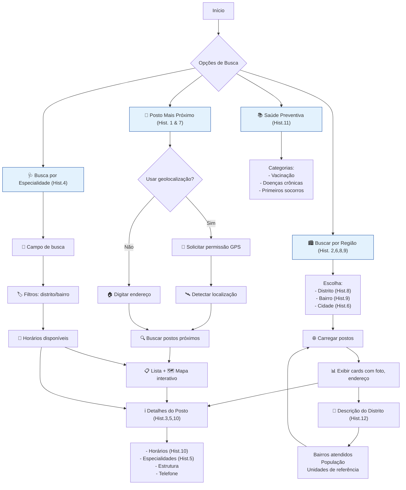

# Diagrama de Atividades - Viva Saúde Recife

**Legenda:**  
📍 Geolocalização | 🏙️ Filtros regionais | 🩺 Especialidades | 📚 Educação em saúde  
ℹ️ Informações detalhadas | 🌐 Dados territoriais | 📅 Horários atualizados

> **Requisitos atendidos:** Todas as 12 histórias de usuário integradas em fluxos complementares.
